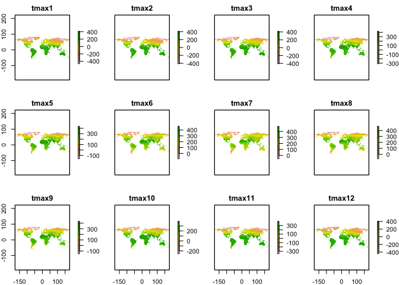
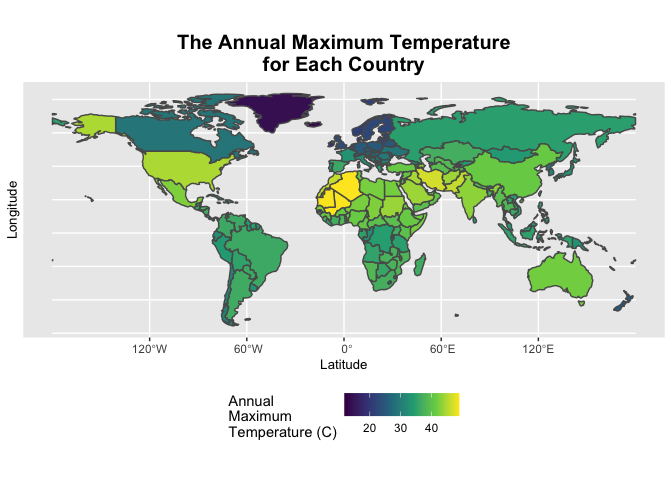

Case Study 06
================
Sunny Yueh
October 12, 2021

``` r
library(raster)  
library(sp)      
library(spData)  
library(tidyverse)
library(sf)       
```

<<<<<<< HEAD
#### Lodaing the data

=======
>>>>>>> 510543ad9dc6413c5df10cb66bb4f9286b60f43e
``` r
data(world)  #load 'world' data from spData package
tmax_monthly <- getData(name = "worldclim", var="tmax", res=10)

library(ncdf4)
#download.file("https://crudata.uea.ac.uk/cru/data/temperature/absolute.nc","crudata.nc")
#tmean=raster("crudata.nc")
```

<<<<<<< HEAD
#### Combing temperature raster data with world polygon

=======
>>>>>>> 510543ad9dc6413c5df10cb66bb4f9286b60f43e
``` r
world<-filter(world, subregion!='Antarctica')
world<-as(world,"Spatial")

<<<<<<< HEAD
monthly<-plot(tmax_monthly)
=======
plot(tmax_monthly)
>>>>>>> 510543ad9dc6413c5df10cb66bb4f9286b60f43e
```

<!-- -->

``` r
<<<<<<< HEAD
monthly
```

    ## NULL

``` r
=======
>>>>>>> 510543ad9dc6413c5df10cb66bb4f9286b60f43e
#Changing the temp
gain(tmax_monthly )<-0.1
tmax_annual<-max(tmax_monthly)
#Change the column name
names(tmax_annual) <- "tmax"

#combine world polygon and the temp raster data
max_tem_country<- raster::extract(tmax_annual, world, fun=max, na.rm=T, small=T, sp=T)
max_tem_country<- st_as_sf(max_tem_country)

<<<<<<< HEAD
plot<-ggplot(data = max_tem_country)+
=======
ggplot(data = max_tem_country)+
>>>>>>> 510543ad9dc6413c5df10cb66bb4f9286b60f43e
  geom_sf(aes(fill=tmax))+
  scale_fill_viridis_c(name="Annual\nMaximum\nTemperature (C)")+
  labs(title="The Annual Maximum Temperature\nfor Each Country")+ 
  xlab("Latitude")+
  ylab("Longitude")+
  theme(plot.title = element_text(face="bold",size=15,hjust = 0.5), axis.title = element_text(size=10))+
  theme(legend.position="bottom")
<<<<<<< HEAD
plot
=======
>>>>>>> 510543ad9dc6413c5df10cb66bb4f9286b60f43e
```

<!-- -->

<<<<<<< HEAD
#### Making the table

=======
>>>>>>> 510543ad9dc6413c5df10cb66bb4f9286b60f43e
``` r
hottest_country<- max_tem_country%>%
  group_by(continent)%>%
  top_n(tmax,n=1)%>%
  select(name_long,continent,tmax)%>%
  arrange(desc(tmax))%>% #arrange the temp from high to low
  st_set_geometry(NULL)


hottest_country
```

    ## # A tibble: 7 × 3
    ## # Groups:   continent [7]
    ##   name_long                           continent                tmax
    ## * <chr>                               <chr>                   <dbl>
    ## 1 Algeria                             Africa                   48.9
    ## 2 Iran                                Asia                     46.7
    ## 3 United States                       North America            44.8
    ## 4 Australia                           Oceania                  41.8
    ## 5 Argentina                           South America            36.5
    ## 6 Spain                               Europe                   36.1
    ## 7 French Southern and Antarctic Lands Seven seas (open ocean)  11.8
