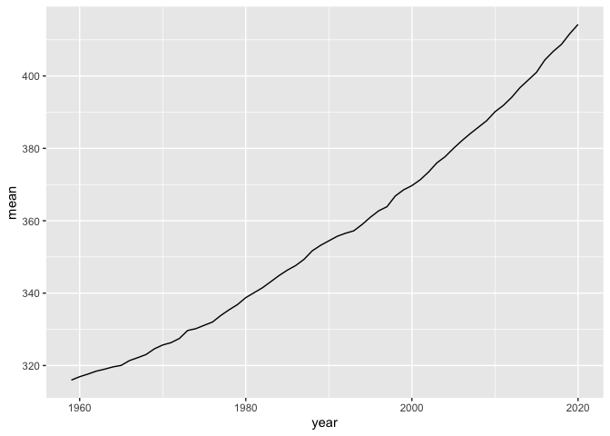

Case Study 08
================
Sunny Yueh
August 1, 2020

``` r
library(tidyverse)
library(knitr)

URL<-"ftp://aftp.cmdl.noaa.gov/products/trends/co2/co2_annmean_mlo.txt"
Data<-read_table(URL,skip=56) 
```

    ## 
    ## ── Column specification ───────────────────────────────────────────────────────────────────────────────────────────
    ## cols(
    ##   `#` = col_logical(),
    ##   year = col_double(),
    ##   mean = col_double(),
    ##   unc = col_double()
    ## )

``` r
Data<-Data[,-1]
```

``` r
ggplot(data=Data,aes(x=year,y=mean))+
  geom_line()
```

<!-- -->

``` r
top5<-Data %>%
  arrange(desc(mean))%>%
  top_n(mean,n=5)

knitr::kable(top5)
```

| year |   mean |  unc |
| ---: | -----: | ---: |
| 2020 | 414.24 | 0.12 |
| 2019 | 411.66 | 0.12 |
| 2018 | 408.72 | 0.12 |
| 2017 | 406.76 | 0.12 |
| 2016 | 404.41 | 0.12 |
