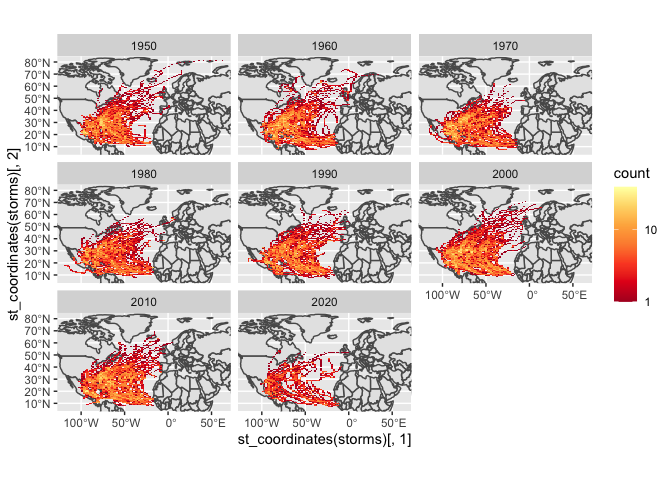

Case Study 09
================
Sunny Yueh
August 1, 2020

``` r
library(sf)
library(tidyverse)
library(ggmap)
library(rnoaa)
library(spData)
data(world)
data(us_states)
```

``` r
# Download zipped data from noaa with storm track information
dataurl="https://www.ncei.noaa.gov/data/international-best-track-archive-for-climate-stewardship-ibtracs/v04r00/access/shapefile/IBTrACS.NA.list.v04r00.points.zip"
tdir=tempdir()
download.file(dataurl,destfile=file.path(tdir,"temp.zip"))
unzip(file.path(tdir,"temp.zip"),exdir = tdir)
list.files(tdir)
```

    ## [1] "IBTrACS.NA.list.v04r00.points.dbf" "IBTrACS.NA.list.v04r00.points.prj"
    ## [3] "IBTrACS.NA.list.v04r00.points.shp" "IBTrACS.NA.list.v04r00.points.shx"
    ## [5] "temp.zip"

``` r
storm_data <- read_sf(list.files(tdir,pattern=".shp",full.names = T))
```

``` r
storms<-storm_data%>%
  filter(SEASON>=1950)%>%
  mutate_if(is.numeric, function(x) ifelse(x==-999.0,NA,x))%>%
  mutate(decade=(floor(year/10)*10)) 

region<-st_bbox(storms)
```

``` r
ggplot()+
  geom_sf(data=world,inherit.aes = F)+
  facet_wrap(~decade)+
  stat_bin2d(data=storms, aes(y=st_coordinates(storms)[,2], x=st_coordinates(storms)[,1]),bins=100)+
  scale_fill_distiller(palette="YlOrRd", trans="log", direction=-1, breaks = c(1,10,100,1000))+
  coord_sf(ylim=region[c(2,4)], xlim=region[c(1,3)])
```

<!-- -->

``` r
us_states<-st_transform(x=us_states,crs=st_crs(storms))

states<-us_states%>%
  select(state=NAME)

storm_states <- st_join(storms, states, join = st_intersects,left = F)

table<-storm_states%>%
  group_by(state)%>%
  summarize(storms=length(unique(NAME)))%>%
  arrange(desc(storms))%>%
  slice(1:5)

table
```

    ## Simple feature collection with 5 features and 2 fields
    ## Geometry type: MULTIPOINT
    ## Dimension:     XY
    ## Bounding box:  xmin: -106.37 ymin: 24.6 xmax: -75.9 ymax: 36.55
    ## Geodetic CRS:  WGS 84
    ## # A tibble: 5 × 3
    ##   state          storms                                                 geometry
    ##   <chr>           <int>                                         <MULTIPOINT [°]>
    ## 1 Florida            84 ((-87.5 30.3), (-87.5 30.9), (-87.44 30.49), (-87.44 30…
    ## 2 North Carolina     64 ((-84 35.3), (-84 35.4), (-83.8 35.14), (-83.6 35.3), (…
    ## 3 Georgia            60 ((-85.44 34.88), (-85.3 33.7), (-85.3 34.9), (-85.27 34…
    ## 4 Texas              54 ((-106.37 31.88), (-105.8 31.5), (-105.32 31.18), (-104…
    ## 5 Louisiana          52 ((-94 32.7), (-93.9 32.7), (-93.9 32.96), (-93.88 32.84…
