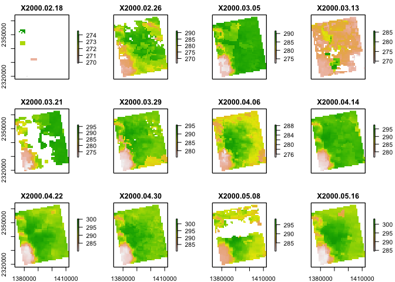

Case Study 10
================
Your Name
August 1, 2020

``` r
library(raster)
```

    ## Loading required package: sp

``` r
library(rasterVis)
```

    ## Loading required package: lattice

``` r
library(rgdal)
```

    ## rgdal: version: 1.5-23, (SVN revision 1121)
    ## Geospatial Data Abstraction Library extensions to R successfully loaded
    ## Loaded GDAL runtime: GDAL 3.1.4, released 2020/10/20
    ## Path to GDAL shared files: /Library/Frameworks/R.framework/Versions/4.0/Resources/library/rgdal/gdal
    ## GDAL binary built with GEOS: TRUE 
    ## Loaded PROJ runtime: Rel. 6.3.1, February 10th, 2020, [PJ_VERSION: 631]
    ## Path to PROJ shared files: /Library/Frameworks/R.framework/Versions/4.0/Resources/library/rgdal/proj
    ## Linking to sp version:1.4-5
    ## To mute warnings of possible GDAL/OSR exportToProj4() degradation,
    ## use options("rgdal_show_exportToProj4_warnings"="none") before loading rgdal.

``` r
library(ggmap)
```

    ## Loading required package: ggplot2

    ## Google's Terms of Service: https://cloud.google.com/maps-platform/terms/.

    ## Please cite ggmap if you use it! See citation("ggmap") for details.

``` r
library(tidyverse)
```

    ## ── Attaching packages ─────────────────────────────────────── tidyverse 1.3.1 ──

    ## ✓ tibble  3.1.5     ✓ dplyr   1.0.5
    ## ✓ tidyr   1.1.3     ✓ stringr 1.4.0
    ## ✓ readr   1.4.0     ✓ forcats 0.5.1
    ## ✓ purrr   0.3.4

    ## ── Conflicts ────────────────────────────────────────── tidyverse_conflicts() ──
    ## x tidyr::extract() masks raster::extract()
    ## x dplyr::filter()  masks stats::filter()
    ## x dplyr::lag()     masks stats::lag()
    ## x dplyr::select()  masks raster::select()

``` r
library(knitr)

# New Packages
library(ncdf4) # to import data from netcdf format
```

``` r
# Create afolder to hold the downloaded data
dir.create("data",showWarnings = F) #create a folder to hold the data

lulc_url="https://github.com/adammwilson/DataScienceData/blob/master/inst/extdata/appeears/MCD12Q1.051_aid0001.nc?raw=true"
lst_url="https://github.com/adammwilson/DataScienceData/blob/master/inst/extdata/appeears/MOD11A2.006_aid0001.nc?raw=true"

# download them
download.file(lulc_url,destfile="data/MCD12Q1.051_aid0001.nc", mode="wb")
download.file(lst_url,destfile="data/MOD11A2.006_aid0001.nc", mode="wb")
```

``` r
lulc=stack("data/MCD12Q1.051_aid0001.nc",varname="Land_Cover_Type_1")
```

    ## [1] ">>>> WARNING <<<  attribute latitude_of_projection_origin is an 8-byte value, but R"
    ## [1] "does not support this data type. I am returning a double precision"
    ## [1] "floating point, but you must be aware that this could lose precision!"
    ## [1] ">>>> WARNING <<<  attribute longitude_of_central_meridian is an 8-byte value, but R"
    ## [1] "does not support this data type. I am returning a double precision"
    ## [1] "floating point, but you must be aware that this could lose precision!"
    ## [1] ">>>> WARNING <<<  attribute longitude_of_projection_origin is an 8-byte value, but R"
    ## [1] "does not support this data type. I am returning a double precision"
    ## [1] "floating point, but you must be aware that this could lose precision!"
    ## [1] ">>>> WARNING <<<  attribute straight_vertical_longitude_from_pole is an 8-byte value, but R"
    ## [1] "does not support this data type. I am returning a double precision"
    ## [1] "floating point, but you must be aware that this could lose precision!"
    ## [1] ">>>> WARNING <<<  attribute false_easting is an 8-byte value, but R"
    ## [1] "does not support this data type. I am returning a double precision"
    ## [1] "floating point, but you must be aware that this could lose precision!"
    ## [1] ">>>> WARNING <<<  attribute false_northing is an 8-byte value, but R"
    ## [1] "does not support this data type. I am returning a double precision"
    ## [1] "floating point, but you must be aware that this could lose precision!"

    ## Warning in .getCRSfromGridMap4(atts): cannot process these parts of the crs:
    ## _CoordinateAxisTypes=GeoX GeoY
    ## horizontal_datum_name=WGS84

    ## Warning in .doTime(r, nc, zvar, dim3): assuming a standard calender:julian

    ## Warning in .doTime(st, nc, zvar, dim3): assuming a standard calender:julian

``` r
lst=stack("data/MOD11A2.006_aid0001.nc",varname="LST_Day_1km")
```

    ## [1] ">>>> WARNING <<<  attribute latitude_of_projection_origin is an 8-byte value, but R"
    ## [1] "does not support this data type. I am returning a double precision"
    ## [1] "floating point, but you must be aware that this could lose precision!"
    ## [1] ">>>> WARNING <<<  attribute longitude_of_central_meridian is an 8-byte value, but R"
    ## [1] "does not support this data type. I am returning a double precision"
    ## [1] "floating point, but you must be aware that this could lose precision!"
    ## [1] ">>>> WARNING <<<  attribute longitude_of_projection_origin is an 8-byte value, but R"
    ## [1] "does not support this data type. I am returning a double precision"
    ## [1] "floating point, but you must be aware that this could lose precision!"
    ## [1] ">>>> WARNING <<<  attribute straight_vertical_longitude_from_pole is an 8-byte value, but R"
    ## [1] "does not support this data type. I am returning a double precision"
    ## [1] "floating point, but you must be aware that this could lose precision!"
    ## [1] ">>>> WARNING <<<  attribute false_easting is an 8-byte value, but R"
    ## [1] "does not support this data type. I am returning a double precision"
    ## [1] "floating point, but you must be aware that this could lose precision!"
    ## [1] ">>>> WARNING <<<  attribute false_northing is an 8-byte value, but R"
    ## [1] "does not support this data type. I am returning a double precision"
    ## [1] "floating point, but you must be aware that this could lose precision!"

    ## Warning in .getCRSfromGridMap4(atts): cannot process these parts of the crs:
    ## _CoordinateAxisTypes=GeoX GeoY
    ## horizontal_datum_name=WGS84

    ## Warning in .doTime(r, nc, zvar, dim3): assuming a standard calender:julian

    ## Warning in .doTime(st, nc, zvar, dim3): assuming a standard calender:julian

``` r
plot(lulc)
```

<!-- -->

``` r
lulc=lulc[[13]]
plot(lulc)
```

<!-- -->

``` r
Land_Cover_Type_1 = c(
    Water = 0, 
    `Evergreen Needleleaf forest` = 1, 
    `Evergreen Broadleaf forest` = 2,
    `Deciduous Needleleaf forest` = 3, 
    `Deciduous Broadleaf forest` = 4,
    `Mixed forest` = 5, 
    `Closed shrublands` = 6,
    `Open shrublands` = 7,
    `Woody savannas` = 8, 
    Savannas = 9,
    Grasslands = 10,
    `Permanent wetlands` = 11, 
    Croplands = 12,
    `Urban & built-up` = 13,
    `Cropland/Natural vegetation mosaic` = 14, 
    `Snow & ice` = 15,
    `Barren/Sparsely vegetated` = 16, 
    Unclassified = 254,
    NoDataFill = 255)

lcd=data.frame(
  ID=Land_Cover_Type_1,
  landcover=names(Land_Cover_Type_1),
  col=c("#000080","#008000","#00FF00", "#99CC00","#99FF99", "#339966", "#993366", "#FFCC99", "#CCFFCC", "#FFCC00", "#FF9900", "#006699", "#FFFF00", "#FF0000", "#999966", "#FFFFFF", "#808080", "#000000", "#000000"),
  stringsAsFactors = F)
# colors from https://lpdaac.usgs.gov/about/news_archive/modisterra_land_cover_types_yearly_l3_global_005deg_cmg_mod12c1
kable(head(lcd))
```

|                             | ID | landcover                   | col      |
| :-------------------------- | -: | :-------------------------- | :------- |
| Water                       |  0 | Water                       | \#000080 |
| Evergreen Needleleaf forest |  1 | Evergreen Needleleaf forest | \#008000 |
| Evergreen Broadleaf forest  |  2 | Evergreen Broadleaf forest  | \#00FF00 |
| Deciduous Needleleaf forest |  3 | Deciduous Needleleaf forest | \#99CC00 |
| Deciduous Broadleaf forest  |  4 | Deciduous Broadleaf forest  | \#99FF99 |
| Mixed forest                |  5 | Mixed forest                | \#339966 |

``` r
# convert to raster (easy)
lulc=as.factor(lulc)

# update the RAT with a left join
levels(lulc)=left_join(levels(lulc)[[1]],lcd)
```

    ## Joining, by = "ID"

``` r
# plot it
gplot(lulc)+
  geom_raster(aes(fill=as.factor(value)))+
  scale_fill_manual(values=levels(lulc)[[1]]$col,
                    labels=levels(lulc)[[1]]$landcover,
                    name="Landcover Type")+
  coord_equal()+
  theme(legend.position = "bottom")+
  guides(fill=guide_legend(ncol=1,byrow=TRUE))
```

<!-- -->

``` r
plot(lst[[1:12]])
```

<!-- -->

``` r
offs(lst)=-273.15
plot(lst[[1:10]])
```

<!-- -->

``` r
lstqc=stack("data/MOD11A2.006_aid0001.nc",varname="QC_Day")
```

    ## [1] ">>>> WARNING <<<  attribute latitude_of_projection_origin is an 8-byte value, but R"
    ## [1] "does not support this data type. I am returning a double precision"
    ## [1] "floating point, but you must be aware that this could lose precision!"
    ## [1] ">>>> WARNING <<<  attribute longitude_of_central_meridian is an 8-byte value, but R"
    ## [1] "does not support this data type. I am returning a double precision"
    ## [1] "floating point, but you must be aware that this could lose precision!"
    ## [1] ">>>> WARNING <<<  attribute longitude_of_projection_origin is an 8-byte value, but R"
    ## [1] "does not support this data type. I am returning a double precision"
    ## [1] "floating point, but you must be aware that this could lose precision!"
    ## [1] ">>>> WARNING <<<  attribute straight_vertical_longitude_from_pole is an 8-byte value, but R"
    ## [1] "does not support this data type. I am returning a double precision"
    ## [1] "floating point, but you must be aware that this could lose precision!"
    ## [1] ">>>> WARNING <<<  attribute false_easting is an 8-byte value, but R"
    ## [1] "does not support this data type. I am returning a double precision"
    ## [1] "floating point, but you must be aware that this could lose precision!"
    ## [1] ">>>> WARNING <<<  attribute false_northing is an 8-byte value, but R"
    ## [1] "does not support this data type. I am returning a double precision"
    ## [1] "floating point, but you must be aware that this could lose precision!"

    ## Warning in .getCRSfromGridMap4(atts): cannot process these parts of the crs:
    ## _CoordinateAxisTypes=GeoX GeoY
    ## horizontal_datum_name=WGS84

    ## Warning in .doTime(r, nc, zvar, dim3): assuming a standard calender:julian

    ## Warning in .doTime(st, nc, zvar, dim3): assuming a standard calender:julian

``` r
plot(lstqc[[1:2]])
```

<!-- -->

``` r
values(lstqc[[1:2]])%>%table()
```

    ## .
    ##    2   17   33   65   81   97  145 
    ## 1569    8    5  675  335    4   90

``` r
rev(as.integer(intToBits(65)[1:8]))
```

    ## [1] 0 1 0 0 0 0 0 1

``` r
QC_Data <- data.frame(Integer_Value = 0:255,
Bit7 = NA, Bit6 = NA, Bit5 = NA, Bit4 = NA,
Bit3 = NA, Bit2 = NA, Bit1 = NA, Bit0 = NA,
QA_word1 = NA, QA_word2 = NA, QA_word3 = NA,
QA_word4 = NA)

## 
for(i in QC_Data$Integer_Value){
AsInt <- as.integer(intToBits(i)[1:8])
QC_Data[i+1,2:9]<- AsInt[8:1]
}

QC_Data$QA_word1[QC_Data$Bit1 == 0 & QC_Data$Bit0==0] <- "LST GOOD"
QC_Data$QA_word1[QC_Data$Bit1 == 0 & QC_Data$Bit0==1] <- "LST Produced,Other Quality"
QC_Data$QA_word1[QC_Data$Bit1 == 1 & QC_Data$Bit0==0] <- "No Pixel,clouds"
QC_Data$QA_word1[QC_Data$Bit1 == 1 & QC_Data$Bit0==1] <- "No Pixel, Other QA"

QC_Data$QA_word2[QC_Data$Bit3 == 0 & QC_Data$Bit2==0] <- "Good Data"
QC_Data$QA_word2[QC_Data$Bit3 == 0 & QC_Data$Bit2==1] <- "Other Quality"
QC_Data$QA_word2[QC_Data$Bit3 == 1 & QC_Data$Bit2==0] <- "TBD"
QC_Data$QA_word2[QC_Data$Bit3 == 1 & QC_Data$Bit2==1] <- "TBD"

QC_Data$QA_word3[QC_Data$Bit5 == 0 & QC_Data$Bit4==0] <- "Emiss Error <= .01"
QC_Data$QA_word3[QC_Data$Bit5 == 0 & QC_Data$Bit4==1] <- "Emiss Err >.01 <=.02"
QC_Data$QA_word3[QC_Data$Bit5 == 1 & QC_Data$Bit4==0] <- "Emiss Err >.02 <=.04"
QC_Data$QA_word3[QC_Data$Bit5 == 1 & QC_Data$Bit4==1] <- "Emiss Err > .04"

QC_Data$QA_word4[QC_Data$Bit7 == 0 & QC_Data$Bit6==0] <- "LST Err <= 1"
QC_Data$QA_word4[QC_Data$Bit7 == 0 & QC_Data$Bit6==1] <- "LST Err > 2 LST Err <= 3"
QC_Data$QA_word4[QC_Data$Bit7 == 1 & QC_Data$Bit6==0] <- "LST Err > 1 LST Err <= 2"
QC_Data$QA_word4[QC_Data$Bit7 == 1 & QC_Data$Bit6==1] <- "LST Err > 4"
kable(head(QC_Data))
```

| Integer\_Value | Bit7 | Bit6 | Bit5 | Bit4 | Bit3 | Bit2 | Bit1 | Bit0 | QA\_word1                  | QA\_word2     | QA\_word3           | QA\_word4     |
| -------------: | ---: | ---: | ---: | ---: | ---: | ---: | ---: | ---: | :------------------------- | :------------ | :------------------ | :------------ |
|              0 |    0 |    0 |    0 |    0 |    0 |    0 |    0 |    0 | LST GOOD                   | Good Data     | Emiss Error \<= .01 | LST Err \<= 1 |
|              1 |    0 |    0 |    0 |    0 |    0 |    0 |    0 |    1 | LST Produced,Other Quality | Good Data     | Emiss Error \<= .01 | LST Err \<= 1 |
|              2 |    0 |    0 |    0 |    0 |    0 |    0 |    1 |    0 | No Pixel,clouds            | Good Data     | Emiss Error \<= .01 | LST Err \<= 1 |
|              3 |    0 |    0 |    0 |    0 |    0 |    0 |    1 |    1 | No Pixel, Other QA         | Good Data     | Emiss Error \<= .01 | LST Err \<= 1 |
|              4 |    0 |    0 |    0 |    0 |    0 |    1 |    0 |    0 | LST GOOD                   | Other Quality | Emiss Error \<= .01 | LST Err \<= 1 |
|              5 |    0 |    0 |    0 |    0 |    0 |    1 |    0 |    1 | LST Produced,Other Quality | Other Quality | Emiss Error \<= .01 | LST Err \<= 1 |

``` r
keep=QC_Data[QC_Data$Bit1 == 0,]
keepvals=unique(keep$Integer_Value)
keepvals
```

    ##   [1]   0   1   4   5   8   9  12  13  16  17  20  21  24  25  28  29  32  33
    ##  [19]  36  37  40  41  44  45  48  49  52  53  56  57  60  61  64  65  68  69
    ##  [37]  72  73  76  77  80  81  84  85  88  89  92  93  96  97 100 101 104 105
    ##  [55] 108 109 112 113 116 117 120 121 124 125 128 129 132 133 136 137 140 141
    ##  [73] 144 145 148 149 152 153 156 157 160 161 164 165 168 169 172 173 176 177
    ##  [91] 180 181 184 185 188 189 192 193 196 197 200 201 204 205 208 209 212 213
    ## [109] 216 217 220 221 224 225 228 229 232 233 236 237 240 241 244 245 248 249
    ## [127] 252 253

``` r
qcvals=table(values(lstqc))  # this takes a minute or two


QC_Data%>%
  dplyr::select(everything(),-contains("Bit"))%>%
  mutate(Var1=as.character(Integer_Value),
         keep=Integer_Value%in%keepvals)%>%
  inner_join(data.frame(qcvals))%>%
  kable()
```

    ## Joining, by = "Var1"

| Integer\_Value | QA\_word1                  | QA\_word2 | QA\_word3              | QA\_word4                  | Var1 | keep  |   Freq |
| -------------: | :------------------------- | :-------- | :--------------------- | :------------------------- | :--- | :---- | -----: |
|              2 | No Pixel,clouds            | Good Data | Emiss Error \<= .01    | LST Err \<= 1              | 2    | FALSE | 150019 |
|             17 | LST Produced,Other Quality | Good Data | Emiss Err \>.01 \<=.02 | LST Err \<= 1              | 17   | TRUE  |  44552 |
|             33 | LST Produced,Other Quality | Good Data | Emiss Err \>.02 \<=.04 | LST Err \<= 1              | 33   | TRUE  |  20225 |
|             49 | LST Produced,Other Quality | Good Data | Emiss Err \> .04       | LST Err \<= 1              | 49   | TRUE  |      3 |
|             65 | LST Produced,Other Quality | Good Data | Emiss Error \<= .01    | LST Err \> 2 LST Err \<= 3 | 65   | TRUE  | 243391 |
|             81 | LST Produced,Other Quality | Good Data | Emiss Err \>.01 \<=.02 | LST Err \> 2 LST Err \<= 3 | 81   | TRUE  | 203501 |
|             97 | LST Produced,Other Quality | Good Data | Emiss Err \>.02 \<=.04 | LST Err \> 2 LST Err \<= 3 | 97   | TRUE  |  25897 |
|            113 | LST Produced,Other Quality | Good Data | Emiss Err \> .04       | LST Err \> 2 LST Err \<= 3 | 113  | TRUE  |     32 |
|            129 | LST Produced,Other Quality | Good Data | Emiss Error \<= .01    | LST Err \> 1 LST Err \<= 2 | 129  | TRUE  |     57 |
|            145 | LST Produced,Other Quality | Good Data | Emiss Err \>.01 \<=.02 | LST Err \> 1 LST Err \<= 2 | 145  | TRUE  |  29607 |
|            161 | LST Produced,Other Quality | Good Data | Emiss Err \>.02 \<=.04 | LST Err \> 1 LST Err \<= 2 | 161  | TRUE  |      3 |
|            177 | LST Produced,Other Quality | Good Data | Emiss Err \> .04       | LST Err \> 1 LST Err \<= 2 | 177  | TRUE  |      5 |

``` r
lstkeep=calc(lstqc,function(x) x%in%keepvals)

gplot(lstkeep[[4:8]])+
  geom_raster(aes(fill=as.factor(value)))+
  facet_grid(variable~.)+
  scale_fill_manual(values=c("blue","red"),name="Keep")+
  coord_equal()+
  theme(legend.position = "bottom")
```

<!-- -->

``` r
tdates=names(lst)%>%
  sub(pattern="X",replacement="")%>%
  as.Date("%Y.%m.%d")

names(lst)=1:nlayers(lst)
lst=setZ(lst,tdates)
```

Part 1.

``` r
lw=SpatialPoints(data.frame(x= -78.791547,y=43.007211))

projection(lw)<-"+proj=longlat"
lw=spTransform(x=lw,CRS("+proj=longlat"))

extract<-raster::extract(lst,lw,buffer=1000,fun=mean,na.rm=T) %>% 
  t()
```

    ## Warning in .local(x, y, ...): Transforming SpatialPoints to the crs of the
    ## Raster

``` r
date<-data.frame(getZ(lst),extract)

date %>%
ggplot(aes(x=getZ.lst.,y=extract)) + geom_point() + geom_smooth(n=nrow(date ),span=0.01)
```

    ## `geom_smooth()` using method = 'loess' and formula 'y ~ x'

    ## Warning: Removed 82 rows containing non-finite values (stat_smooth).

    ## Warning in simpleLoess(y, x, w, span, degree = degree, parametric =
    ## parametric, : k-d tree limited by memory. ncmax= 729

    ## Warning in predLoess(object$y, object$x, newx = if
    ## (is.null(newdata)) object$x else if (is.data.frame(newdata))
    ## as.matrix(model.frame(delete.response(terms(object)), : k-d tree limited by
    ## memory. ncmax= 729

    ## Warning: Removed 82 rows containing missing values (geom_point).

<!-- -->

Part2.

``` r
tmonth<- as.numeric(format(getZ(lst),"%m"))
lst_month <- stackApply(lst,tmonth,fun=mean)
names(lst_month)=month.name

gplot(lst_month)+
  geom_raster(aes(fill=value)) + 
  facet_wrap(~variable) + 
  coord_equal()+ 
  theme(legend.position="right") +
  scale_fill_continuous()
```

<!-- -->

``` r
cellStats(lst_month,mean)
```

    ##   January  February     March     April       May      June      July    August 
    ## -2.127507  8.710271 18.172077 23.173591 26.990005 28.840144 27.358260 22.927727 
    ## September   October  November  December 
    ## 15.477510  8.329881  0.586179 -4.754134
