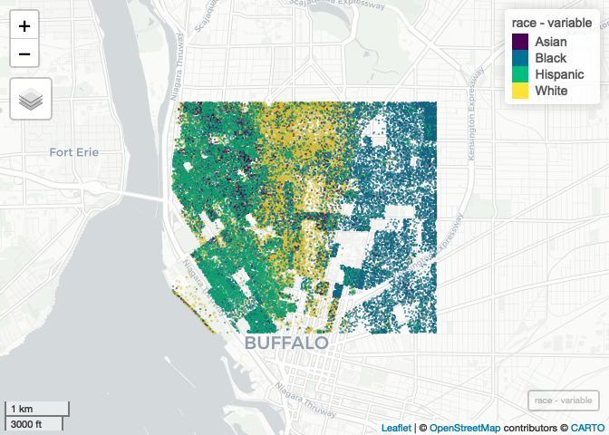

Case Study 11
================
Sunny
August 1, 2020

``` r
#library(tidyverse)
library(spData)
```

    ## To access larger datasets in this package, install the spDataLarge
    ## package with: `install.packages('spDataLarge',
    ## repos='https://nowosad.github.io/drat/', type='source')`

``` r
library(sf)
```

    ## Linking to GEOS 3.8.1, GDAL 3.2.1, PROJ 7.2.1

``` r
## New Packages
library(mapview) # new package that makes easy leaflet maps
library(foreach)
library(doParallel)
```

    ## Loading required package: iterators

    ## Loading required package: parallel

``` r
registerDoParallel(4)
getDoParWorkers() # check registered cores
```

    ## [1] 4

``` r
library(tidycensus)
census_api_key("194dc0f83d1499575346fa0ee9bfc523fe9bfc5c",install = TRUE,overwrite=TRUE)
```

    ## Your original .Renviron will be backed up and stored in your R HOME directory if needed.

    ## Your API key has been stored in your .Renviron and can be accessed by Sys.getenv("CENSUS_API_KEY"). 
    ## To use now, restart R or run `readRenviron("~/.Renviron")`

    ## [1] "194dc0f83d1499575346fa0ee9bfc523fe9bfc5c"

``` r
remotes::install_github("walkerke/tidycensus",force = TRUE)
```

    ## Downloading GitHub repo walkerke/tidycensus@HEAD

    ## 
    ##      checking for file ‘/private/var/folders/ck/xznvxfk11sl2cf_dfvfk9ncc0000gn/T/RtmpT77wtb/remotes1256a9861119/walkerke-tidycensus-8276111/DESCRIPTION’ ...  ✓  checking for file ‘/private/var/folders/ck/xznvxfk11sl2cf_dfvfk9ncc0000gn/T/RtmpT77wtb/remotes1256a9861119/walkerke-tidycensus-8276111/DESCRIPTION’
    ##   ─  preparing ‘tidycensus’:
    ##      checking DESCRIPTION meta-information ...  ✓  checking DESCRIPTION meta-information
    ##   ─  checking for LF line-endings in source and make files and shell scripts
    ##   ─  checking for empty or unneeded directories
    ##   ─  building ‘tidycensus_1.1.0.9000.tar.gz’
    ##      
    ## 

``` r
library(tidyverse)
```

    ## ── Attaching packages ─────────────────────────────────────── tidyverse 1.3.1 ──

    ## ✓ ggplot2 3.3.5     ✓ purrr   0.3.4
    ## ✓ tibble  3.1.6     ✓ dplyr   1.0.7
    ## ✓ tidyr   1.1.4     ✓ stringr 1.4.0
    ## ✓ readr   2.1.0     ✓ forcats 0.5.1

    ## ── Conflicts ────────────────────────────────────────── tidyverse_conflicts() ──
    ## x purrr::accumulate() masks foreach::accumulate()
    ## x dplyr::filter()     masks stats::filter()
    ## x dplyr::lag()        masks stats::lag()
    ## x purrr::when()       masks foreach::when()

``` r
library(tidycensus)
```

``` r
racevars <- c(White = "P005003", 
              Black = "P005004", 
              Asian = "P005006", 
              Hispanic = "P004003")

options(tigris_use_cache = TRUE)
erie <- tidycensus::get_decennial(geography = "block", variables = racevars, 
                  state = "NY", county = "Erie County", geometry = TRUE,
                  summary_var = "P001001", cache_table=T) 
```

    ## Getting data from the 2010 decennial Census

    ## Using Census Summary File 1

``` r
lim<-c(xmin=-78.9,xmax=-78.85,ymin=42.888,ymax=42.92)
erie_crop<-st_crop(erie,lim)
```

    ## Warning: attribute variables are assumed to be spatially constant throughout all
    ## geometries

``` r
race<-foreach(i=unique(erie_crop$variable),.combine=rbind)  %dopar% {
 filter(erie_crop,variable==i)%>%
    st_sample(size=.$value)%>%
    st_as_sf()%>%
    mutate(variable =i)
}

mapview(race,zcol="variable",cex=0.1,alpha=0.1)  
```

<!-- -->
